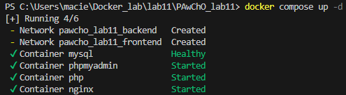
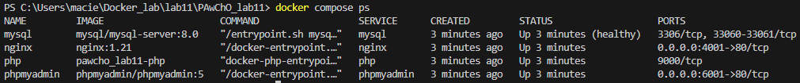
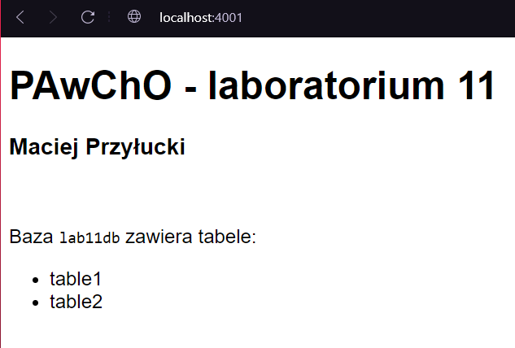
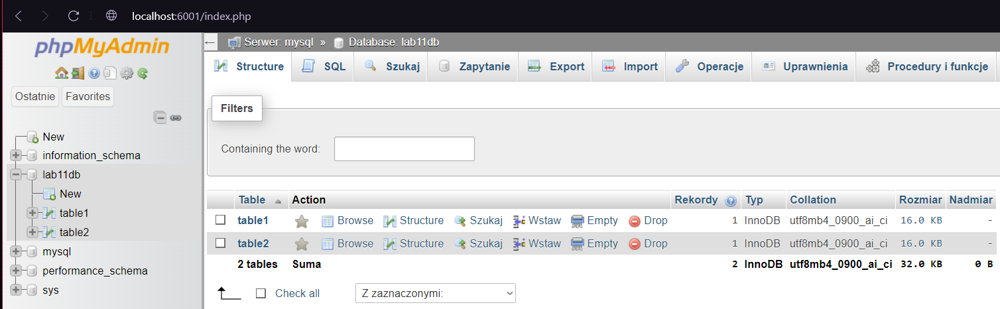

# Programowanie Aplikacji w Chmurze Obliczeniowej - Laboratorium 11
### Maciej Przyłucki

Użyte polecenia:

1. Uruchomienie kontenerów  
  
2. Sprawdzenie działających kontenerów  
  

Działanie aplikacji:

1. Nginx (port 4001)  
  
2. Phpmyadmin (port 6001)  
  

Wykorzystane obrazy:

1. Nginx: 1.21
2. PHP: 8.1-fpm ([Dockerfile](./.docker/php/Dockerfile))
3. MySQL: 8.0
4. Phpmyadmin: 5
